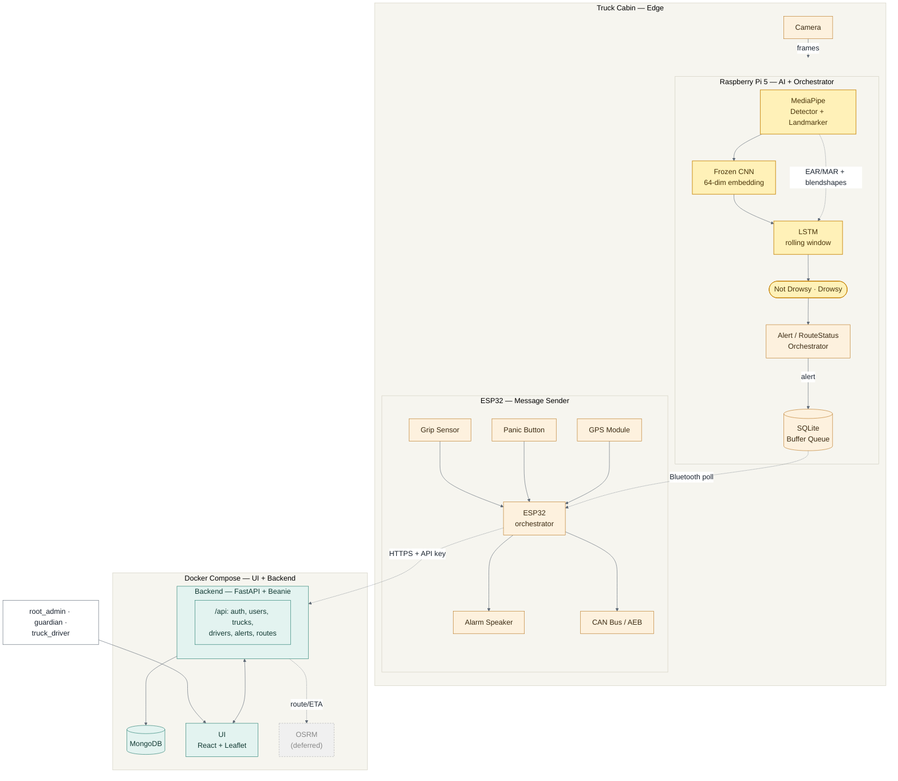

# Argus — system architecture overview

**Status:** current · **Companion to:** `docs/designs/semantic-design.drawio.xml` (the
detailed, canonical diagram — API-endpoint level, opened/edited in
[diagrams.net](https://app.diagrams.net)). This file is the lightweight, text-versioned view of
the same architecture: quick to read on GitHub, easy to diff, and safe to paste into the
`borrador-proyecto-modular-argus.md` or a slide without exporting an image.

`docs/designs/argus_diagrama_v2.png` is the **retired** AWS-serverless concept (IoT Core,
Lambda, DynamoDB, Cognito) from the early, AWS-oriented `Argus_Definicion_Tecnica.docx.pdf`
technical definition. It's kept for history only — nothing in this repo implements it, and it
should not be read as a current design.

Measured with `docs/designs/scripts/measure_diagram.py` (renders the diagram headlessly via
mermaid.ink, parses the returned SVG's real node/cluster coordinates, sums their area against
the canvas area — `python3 measure_diagram.py diagram.mmd`, where `diagram.mmd` is this fenced
block's contents): base font has been bumped twice now, `13px → 16px → 20px`. The ESP32 and
Docker Compose boxes were deliberately flattened by switching their internal direction from
`TB` to `LR` — measured per-box aspect ratio (width:height) went from 1.55:1 → 2.50:1 for the
ESP32 box and 1.47:1 → 2.07:1 for the Docker Compose box. That flattening pulled the *overall*
diagram out to **1.55:1** / 66.6% fill (from 1.31:1 / 74.5% before flattening) — a real,
accepted trade-off: those two boxes' shape was the explicit ask, not the whole-canvas ratio.
`nodeSpacing`/`rankSpacing` were re-swept each time the font grew — every size change shifts how
much clearance a cluster title needs before its first child box, and the script's per-cluster
margin check has caught a real (if small, 1-3px) overlap regression at each of the last three
font bumps. At `20px` the settled values are `nodeSpacing: 58`, `rankSpacing: 74`, both re-swept
for a ≥7px margin rather than the bare minimum that happened to render clean once.

Rejected along the way, all measured: pure `LR` (6.4:1, too wide for a document page); pure `TB`
with every subgraph inheriting the outer direction (0.52:1, overcorrects into a tall strip); a
`TB`/`LR` mix that put the Docker Compose cluster beside the edge zone instead of below it
(1.65:1, worse fill). The 8-way sweep over each subgraph's internal direction is what found the
squarest prior version; this pass re-flattened two of those boxes on top of it by request.

## Reading key

- **Amber** — truck-cabin edge hardware (camera, sensors, Pi orchestrator, ESP32, actuators).
- **Gold** — the computer-vision module (`cv-argus`): MediaPipe → frozen CNN embedding → LSTM →
  binary classification, feeding the orchestrator.
- **Teal** — the cloud side, one Docker Compose stack: FastAPI + Beanie backend, MongoDB, the
  React/react-leaflet UI.
- **Dashed border** — deferred, not built yet (OSRM).
- **Dashed connector** — a wireless/network hop (Pi↔ESP32 over Bluetooth, ESP32↔backend over
  HTTPS with a per-truck device API key) as opposed to a direct wired connection.

Note the grip sensor, panic button, and geolocation module all feed the **ESP32**, not the Pi —
the ESP32 owns everything actuation- and sensor-critical (alarm, AEB, panic, GPS), while the Pi
only runs the vision pipeline and decides what to do with its output.

## What changed from the earlier AWS concept

- **Removed:** the AWS-serverless tower (IoT Core, Lambda, DynamoDB, Cognito, Amazon Location
  Service, API Gateway, CDK/IaC) — that side of `argus_diagrama_v2.png` never had code behind
  it and is superseded by the Docker Compose stack that `src/backend-argus` and `src/ui-argus`
  actually are.
- **Replaced with:** Docker Compose running the UI and backend together, per
  `src/backend-argus/CLAUDE.md` and the root `docker-compose.yml`.
- **Added:** the computer-vision module drawn explicitly as its own block — MediaPipe → CNN
  (frozen embedding) → LSTM → orchestrator — matching what `src/cv-argus` deploys today (see
  the root `CLAUDE.md`'s "Current deployment status").

## Still out of scope here

The ESP32 firmware and OSRM remain design-only (no code yet); `Report`, `Device`, and
`Geofence` stay out of the backend's scope until something consumes them. See `docs/roadmap.md`
for the authoritative gap list.
